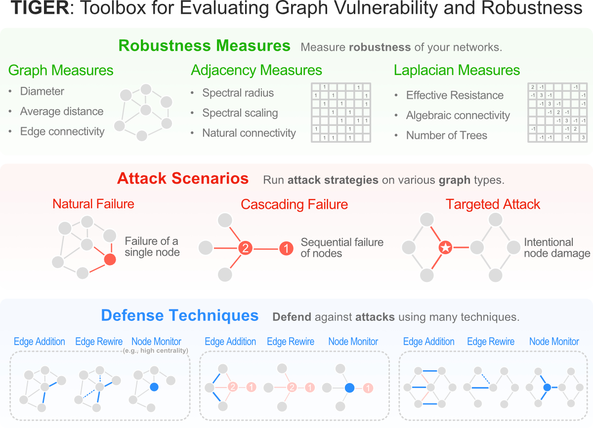

TIGER is an open-sourced Python toolbox containing 22 graph **robustness measures** with both original and fast 
approximate versions; 17 **attack strategies**; 15 heuristic and optimization based **defense techniques**; and 4 **simulation tools**.
Specifically, TIGER is specifically designed to help users:

1. **Quantify** network *vulnerability* and *robustness*, 
2. **Simulate** a variety of network attacks, cascading failures and spread of dissemination of entities
3. **Augment** a network's structure to resist *attacks* and recover from *failure* 
4. **Regulate** the dissemination of entities on a network (e.g., viruses, propaganda). 

### Setup
TIGER was designed for the Linux environment using Python 3, however, we don't foresee any issues running
it on Mac or Windows. 
To quickly get started download [TIGER](https://github.com/safreita1/TIGER.git) and create a new Anaconda environment using the provided 
[YAML](environment.yml) file.

To use the built-in graph dataset helper functions, do the following:
1. create a folder called "dataset" in the main directory.
2. call the function [get_graph_urls()](graph-tiger/graphs.py) to get a list of urls containing the datasets used in all our
experiments.
3. run [wget](https://www.gnu.org/software/wget/) "url goes here" and place the downloaded graph inside the dataset folder.

### Examples
Inside the [experiments](graph-tiger/experiments) folder we provide extensive examples on how to use TIGER.
Below we'll discuss few examples to get you started (all results should auto-populate in a folder called "plots"):

#### EX 1. Calculate graph robustness (e.g., spectral radius, effective resistance)
    from measures import run_measure
    from graphs import graph_loader
    
    graph = graph_loader(graph_type='BA', n=1000, seed=1)
    
    spectral_radius = run_measure(graph, measure='spectral_radius')
    print("Spectral radius:", spectral_radius)
    
    effective_resistance = run_measure(graph, measure='effective_resistance')
    print("Effective resistance:", effective_resistance)
        
        
#### EX 2. Calculate approximate graph robustness (e.g., effective resistance k=30 eigenvalues)
    from measures import run_measure
    from graphs import graph_loader
    
    graph = graph_loader(graph_type='BA', n=1000, seed=1)
    
    effective_resistance = run_measure(graph, measure='effective_resistance', k=30)
    print("Effective resistance (k=30):", effective_resistance)
    

### EX 3. Run a cascading failure simulation on a Barabasi Albert graph
    from cascading import Cascading
    from graphs import graph_loader
    
    graph = graph_loader('BA', n=400, seed=1)
    
    params = {
        'runs': 1,
        'steps': 100,
        'seed': 1,

        'l': 0.8,
        'r': 0.2,
        'c': int(0.1 * len(graph)),
    
        'k_a': 30,
        'attack': 'rb_node',
        'attack_approx': int(0.1 * len(graph)),
    
        'k_d': 0,
        'defense': None,
    
        'robust_measure': 'largest_connected_component',
    
        'plot_transition': True,  # False turns off key simulation image "snapshots"
        'gif_animation': False,  # True creaets a video of the simulation (MP4 file)
        'gif_snaps': False,  # True saves each frame of the simulation as an image
    
        'edge_style': 'bundled',
        'node_style': 'force_atlas',
        'fa_iter': 2000,
    }
    
    cascading = Cascading(graph, **params)
    results = cascading.run_simulation()
    
    cascading.plot_results(results)
    
Step 0: Network pre-attack | Step 6: Beginning of cascading failure | Step 99: Collapse of network
:-------------------------:|:-------------------------:|:-------------------------:
  |    |  
    
    

    
### EX 4. Run an SIS virus simulation on a Barabasi Albert graph
    from diffusion import Diffusion
    from graphs import graph_loader
    
    graph = graph_loader('BA', n=400, seed=1)
    
    
    sis_params = {
        'model': 'SIS',
        'b': 0.001,
        'd': 0.01,
        'c': 1,
    
        'runs': 1,
        'steps': 5000,
        'seed': 1,
    
        'diffusion': 'min',
        'method': 'ns_node',
        'k': 5,
    
        'plot_transition': True,
        'gif_animation': False,
    
        'edge_style': 'bundled',
        'node_style': 'force_atlas',
        'fa_iter': 2000
    }
    
    diffusion = Diffusion(graph, **sis_params)
    results = diffusion.run_simulation()
    
    diffusion.plot_results(results)
    
    
Step 0: Virus infected network |Step 80: Partially infected network | Step 4999: Virus contained
:-------------------------:|:-------------------------:|:-------------------------:
  |  |  

